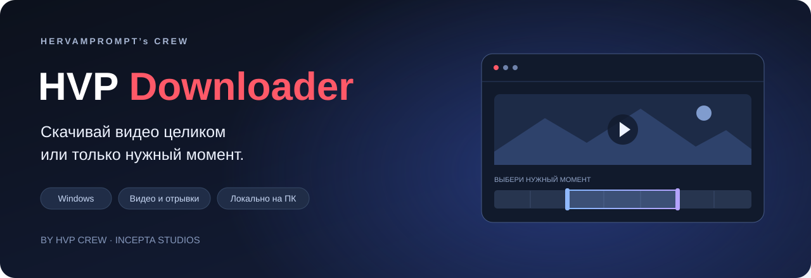

  

  <strong>Вставь ссылку. Выбери момент. Сохрани себе.</strong> 
  Приложение для Windows от HVP CREW и Incepta Studios.

  <a href="https://github.com/dmitry3101-design/hvp-downloader-releases/releases/latest"><strong>↓ Последняя версия для Windows</strong></a>
  &nbsp; · &nbsp;
  <a href="https://github.com/dmitry3101-design/hvp-downloader-releases/releases">История обновлений</a>
  &nbsp; · &nbsp;
  <a href="https://www.instagram.com/incepta.studios/">@incepta.studios</a>

> **Установщик готовится к загрузке.** Сейчас в релизе опубликовано описание версии. Автоматические архивы `Source code` не содержат приложение. После прикрепления установщика здесь появится прямая ссылка на скачивание.

## Нужен только отрывок?

Открой видео по ссылке или с компьютера, укажи начало и конец — HVP Downloader сохранит выбранный момент. Можно скачать и весь ролик, выбрать доступное качество или сохранить только звук.

| Возможность | Что можно сделать |
| :--- | :--- |
| Видео по ссылке | Открыть отдельный ролик или пост с видео |
| Обрезка | Выделить отрывок на шкале или ввести точное время |
| Качество | Выбрать из доступных у источника вариантов |
| Видео или звук | Сохранить MP4 со звуком или аудио M4A |
| Локальные файлы | Открыть и обрезать видео с компьютера |
| Обновления | Проверить новую версию в настройках приложения |

### Источники

**YouTube · Instagram · Facebook · LinkedIn · Vimeo · VK · VK Video · Rutube · X**

Ссылки Яндекс Видео открываются через исходный сайт, если он поддерживается. Доступность конкретного ролика зависит от сайта, региона и настроек доступа; иногда требуется вход через свой файл `cookies.txt`.

## Как пользоваться

1. Установи приложение для **Windows 10/11 x64**.
2. Вставь ссылку на видео или нажми **«Файл»**, чтобы открыть ролик с компьютера.
3. Выбери **«Всё видео»** или выдели нужный отрывок.
4. Укажи качество, формат и папку сохранения — затем нажми **«Скачать»**.

Обработка выполняется на твоём компьютере. Объём загрузки зависит от источника: для отрывка не каждый сайт позволяет получить только выбранный участок.

## Обновления

В установленной версии открой **Настройки → Обновление приложения → Проверить обновления**. Когда новая версия опубликована, можно скачать её и нажать **«Обновить и перезапустить»**. Установка обновления доступна после завершения текущей задачи.

Нижняя кнопка **«Загрузчик → Проверить и обновить»** отдельно обновляет компонент загрузки видео.

При переходе с переносимой версии нужно один раз установить приложение. Папку сохранения и cookies можно выбрать заново; ранее скачанные файлы остаются на месте.

<strong>Какие файлы в релизе нужны пользователю?</strong>

Для установки нужен только файл **`HVP-Downloader-Setup-…exe`**. Файлы `.blockmap` и `latest.yml` использует механизм обновлений. Архивы `Source code`, которые GitHub добавляет автоматически, не являются установщиком.

Цифровая подпись издателя пока отсутствует. Лицензии используемых компонентов находятся в установленной папке приложения.

---

  <strong>HERVAMPROMPT’s CREW</strong> 
  Создано Incepta Studios · <a href="https://www.instagram.com/incepta.studios/">@incepta.studios</a> 
  Сохраняй материалы, которые тебе разрешено скачивать и обрабатывать.

Этот репозиторий содержит официальные релизы приложения. Исходный код приложения здесь не публикуется.
